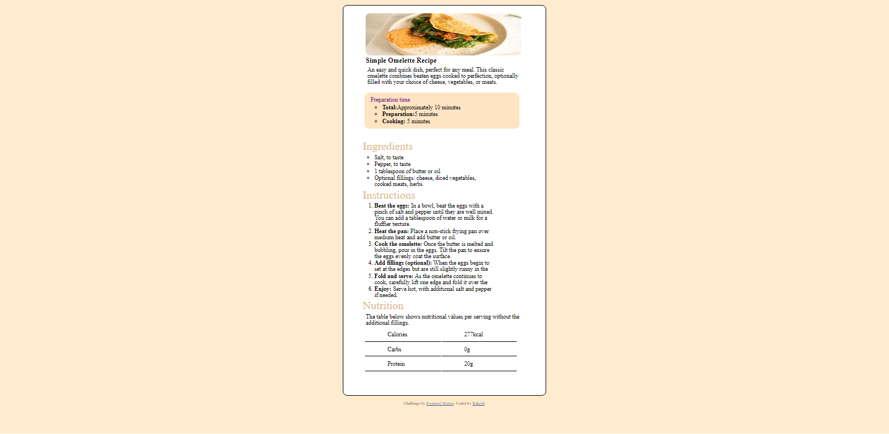

# Frontend Mentor - Recipe page solution

This is a solution to the [Recipe page challenge on Frontend Mentor](https://www.frontendmentor.io/challenges/recipe-page-KiTsR8QQKm). Frontend Mentor challenges help you improve your coding skills by building realistic projects. 

## Table of contents

- [Screenshot](#screenshot)
- [Built with](#built-with)
- [What I learned](#what-i-learned)
- [Author](#author)

### Screenshot

### Built with

- HTML5 markup
- CSS custom properties
### What I learned

Using this i have recap my basics about basic styling with box model .

## Author

- Frontend Mentor - [Rakesh](https://www.frontendmentor.io/profile/RAKESH40-lgtm)